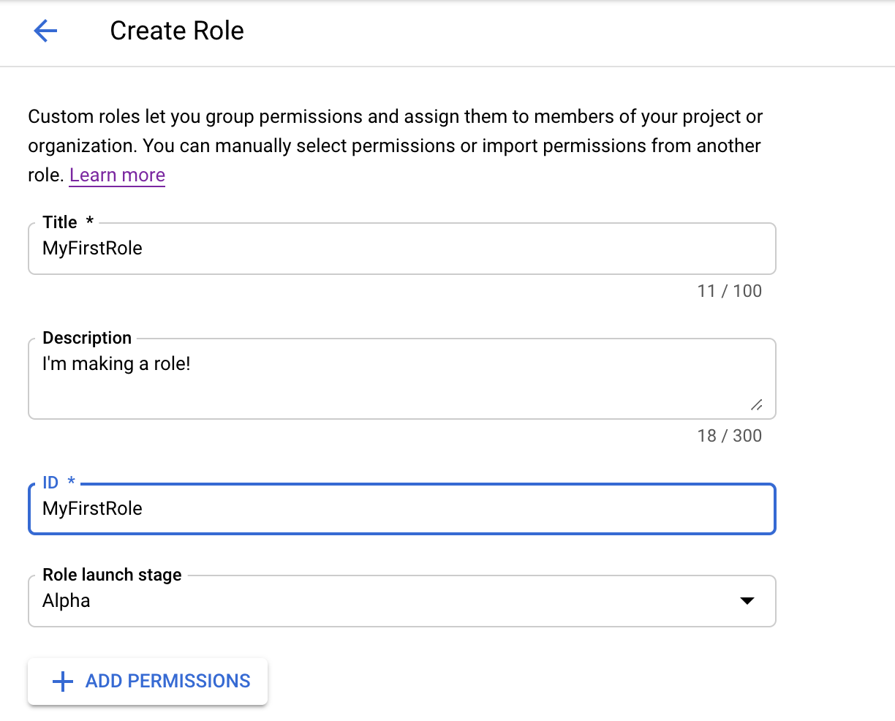
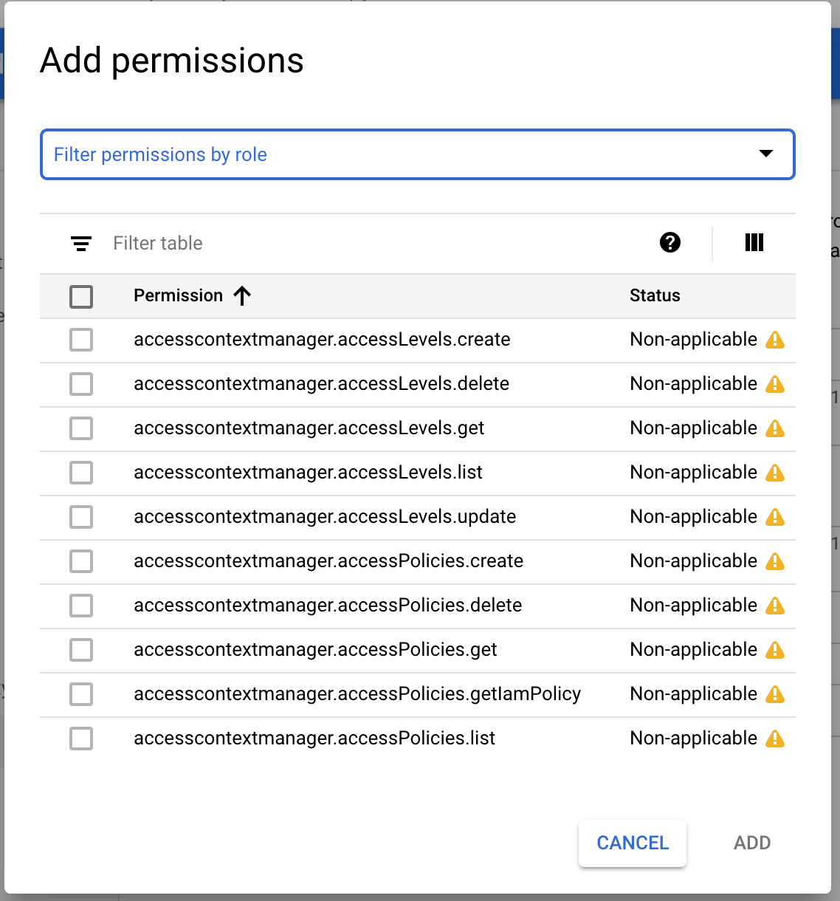
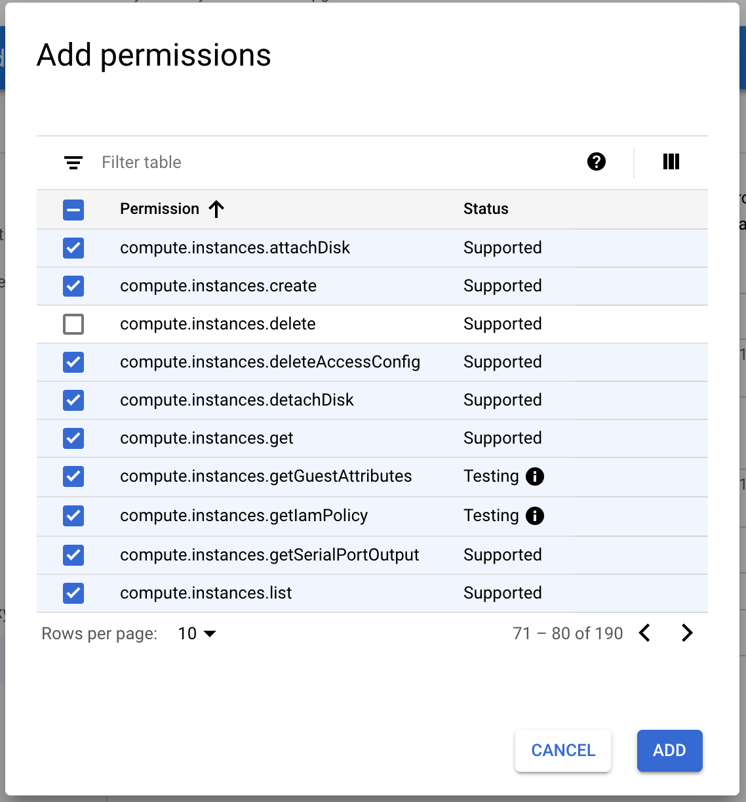

Solution:
-----
To complete this in the console, follow these steps:

1. In the console, open the left nav bar, and go to `IAM & Admin` > `Roles`.
1. On the top of the Roles menu, select `+ Create Role`.

1. Fill out the `Title`, `Description` and `ID` fields. Leave the `Role launch stage` in Alpha.

4. Select `+ Add Permissions`

5. Filter by `Compute Instance Admin (beta)` to adhere to PoLP (Principle of Least Privilege).

6. In the console you have to add all permissions 10 at a time, make sure to exclude the `compute.instances.delete` permission. Add the other 189 permissions.

7. Create the role.

8. Confirm that the role is listed in the console.

